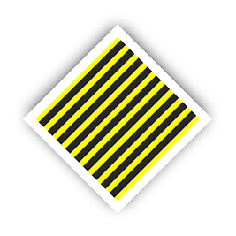

# RSShapeNode

A `RSShapeNode` object draws a shape by rendering a Core Graphics path offscreen using a disconnected `CAShapeLayer`.  The `CAShapeLayer` is then snapshoted into an image and used as a texture of a `SKSpriteNode`, which is added as a child to the `RSShapeNode`. This technique fixes the insane amount of unfixable bugs and memory leaks of `SKShapeNode`.

`RSShapeNode` has nearly the complete functionality of a `SKShapeNode` plus additional functionality that is missing in `SKShapeNode`, e.g. repeated textures, shadows, line dash patterns and fill rules.

The inspiration of this technique comes from the thread: [`SKShapeNode`, you are dead to me](http://sartak.org/2014/03/skshapenode-you-are-dead-to-me.html)

**Note:** `RSShapeNode` rerenders its image every time one of its variables its changed, except if there is no path specified. Check that you are setting the path at the last moment possible.



## Installation

`RSShapeNode` is not yet released on CocoaPod. Instead use

```
use_frameworks!

pod 'RSShapeNode', :git => 'https://github.com/rusty1s/RSShapeNode.git'
```

in your Podfile and run `pod install`.

## Documentation

	class RSShapeNode : SKNode { ... }
	
### Initializiers

	init(var path: CGPath, centered: Bool = false)

Creates a shape node from a Core Graphics path.

	init(rect: CGRect)

Creates a shape node with a rectangular path.

	init(rectOfSize size: CGSize)	

Creates a shape node with a rectangular path centered on the node’s origin.

	init(rect: CGRect, cornerRadius radius: CGFloat)

Creates a shape with a rectangular path with rounded corners.

	init(rectOfSize size: CGSize, cornerRadius radius: CGFloat)

Creates a shape with a rectangular path with rounded corners centered on the node’s origin.

	init(circleOfRadius radius: CGFloat)

Creates a shape node with a circular path centered on the node’s origin.

	init(ellipseOfSize size: CGSize)

Creates a shape node with an elliptical path centered on the node’s origin.

	init(ellipseInRect rect: CGRect)	

Creates a shape node with an elliptical path that fills the specified rectangle.

	init(points: [CGPoint], closed: Bool = true)

Creates a shape node from a series of points.

	init(controlPoints points: [CGPoint], closed: Bool = true)

Creates a shape node with a quadratic Bézier curve from a series of control points.

### Instance variables

	var path: CGPath?

The path that defines the shape.

	var fillColor: SKColor

The color used to fill the shape.  The default fill color is `SKColor.clearColor()`, which means the shape is not filled.

	var fillTexture: SKTexture?

The texture used to fill the shape above its fill color. The default value is `nil`.

	var fillTextureStyle: TextureStyle

The style used to draw the fill texture. The default value is `.Scale`, which means the texture is scaled to fit the shapes bounding box.

	var fillTextureOffset: CGPoint

If the current fill texture style is set to `.Repeat`, the fill texture offset determines where the texture has its origin. The default value is `CGPointZero`.	 

	var lineWidth: CGFloat

The width used to stroke the path. The default value is 1.0.

	var strokeColor: SKColor

The color used to stroke the shape’s path. The default stroke color is `SKColor.whiteColor()`. If you do not want to stroke the shape, use `SKColor.clearColor()`.

	var lineCap: LineCap

Specifies the line cap style for the shape’s path. The line cap style specifies the shape of the endpoints of an open path when stroked. The default value is `.Butt`.

	var lineJoin: LineJoin

Specifies the line join style for the shape’s path. The line join style specifies the shape of the joints between connected segments of a stroked path. The default value is `.Miter`.

	var miterLimit: CGFloat

The miter limit used when stroking the shape’s path. If the current line join style is set to `.Miter`, the miter limit determines whether the lines should be joined with a bevel instead of a miter. The length of the miter is divided by the line width. If the result is greater than the miter limit, the path is drawn with a bevel. The default value is 10.0.

	var fillRule: FillRule

The fill rule used when filling the shape’s path. The default value is `.NonZero`.

	var lineDashPattern: [CGFloat]?

The dash pattern applied to the shape’s path when stroked. The dash pattern is specified as an array of `CGFloat` that specify the lengths of the painted segments and unpainted segments, respectively, of the dash pattern.  Default is `nil`, a solid line.

	var lineDashPhase: CGFloat

The dash phase applied to the shape’s path when stroked. Line dash phase specifies how far into the dash pattern the line starts. The defaut value is 0.0.

	var strokeStart: CGFloat 

The relative location at which to begin stroking the path. The value of this property must be in the range 0.0 to 1.0. The default value of this property is 0.0.

	var strokeEnd: CGFloat

The relative location at which to stop stroking the path. The value of this property must be in the range 0.0 to 1.0. The default value of this property is 1.0.

	var shadowRadius: CGFloat

The blur radius (in points) used to render the shape’s shadow. The default value of this property is 0.0.

	var shadowColor: SKColor

The color of the shape’s shadow. The default value is `SKColor.blackColor()`.

	var shadowOpacity: CGFloat

The opacity of the shape’s shadow. The value in this property must be in the range 0.0 (transparent) to 1.0 (opaque). The default value of this property is 1.0.						

	var blendMode: SKBlendMode

The blend mode used to blend the shape into the parent’s framebuffer. The default value is `SKBlendModeAlpha`.						

	public var shader: SKShader?

A property that determines whether the sprite is rendered using a custom shader. The default value is `nil`.

## Additional information

`RSShapeNode` was developed and implemented for the use in *Dig Deeper - the Mining / Crafting / Trading game*. *Dig Depper* is currently in developement and has its own *GitHub* project [here](../../../DigDeeper).


## License

Copyright (c) 2015 Matthias Fey <matthias.fey@tu-dortmund.de>

Permission is hereby granted, free of charge, to any person obtaining a copy of this software and associated documentation files (the "Software"), to deal in the Software without restriction, including without limitation the rights to use, copy, modify, merge, publish, distribute, sublicense, and/or sell copies of the Software, and to permit persons to whom the Software is furnished to do so, subject to the following conditions:

The above copyright notice and this permission notice shall be included in all copies or substantial portions of the Software.

THE SOFTWARE IS PROVIDED "AS IS", WITHOUT WARRANTY OF ANY KIND, EXPRESS OR IMPLIED, INCLUDING BUT NOT LIMITED TO THE WARRANTIES OF MERCHANTABILITY, FITNESS FOR A PARTICULAR PURPOSE AND NONINFRINGEMENT. IN NO EVENT SHALL THE AUTHORS OR COPYRIGHT HOLDERS BE LIABLE FOR ANY CLAIM, DAMAGES OR OTHER LIABILITY, WHETHER IN AN ACTION OF CONTRACT, TORT OR OTHERWISE, ARISING FROM, OUT OF OR IN CONNECTION WITH THE SOFTWARE OR THE USE OR OTHER DEALINGS IN THE SOFTWARE.